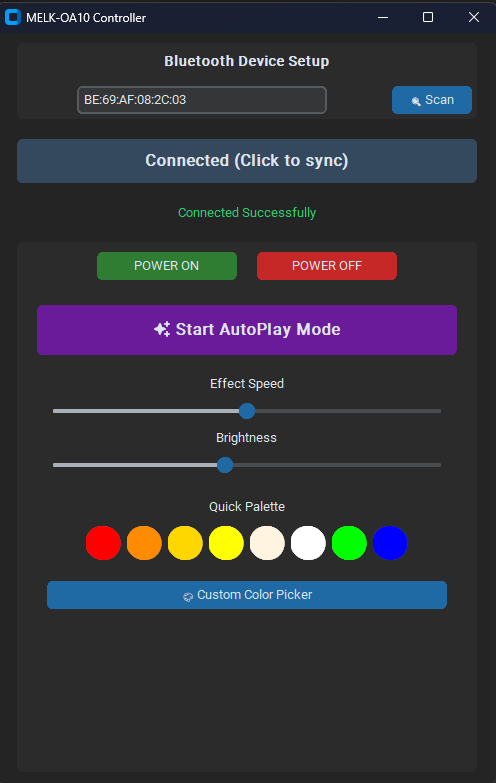

# MELK-OA10 Bluetooth LED Lamp Control



A high-performance, user-friendly Python control system for **MELK-OA10 (ELK-BLEDOM)** series Bluetooth LED lamps. 

## ✨ Key Features
- **Built-in Scanner**: Discover nearby lamps directly from the GUI.
- **Smart Persistence**: Remembers your last-connected lamp automatically via `devices.json`.
- **Dynamic Connection**: No more hardcoded MAC addresses—just scan, connect, and control.
- **Modern GUI**: Premium dark-mode interface powered by `customtkinter`.
- **Verified Protocol**: Native 9-byte command structure confirmed for MELK-OA hardware.
- **Precise Speed Control**: Calibrated 0-100 range mapped to firmware limits.
- **Warm Palette**: Quick-access buttons for cozy ambiance (Orange, Gold, Warm White).
- **Custom Color Picker**: Full RGB support with high-precision conversion.

## 📦 Installation

1. **Prerequisites**:
   - Python 3.10+
   - [uv](https://astral.sh/uv)

2. **Setup**:
   ```powershell
   uv sync
   ```

3. **Run**:
   ```powershell
   uv run gui_lamp.py
   ```

## 🛠️ Usage
1. Click **🔍 Scan** to find your lamp.
2. The address will be saved to `devices.json`.
3. Click **⚡ Connect to Lamp** to begin control.
4. Use **✨ Start AutoPlay Mode** to trigger the default cycle effect.

---
*Developed for the MELK-OA10 series.*
